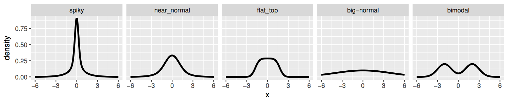

We use the [dscr](https://github.com/stephens999/dscr) package to perform dynamic comparisons for the DE (differential expression) methods on simulated RNA-seq data (simulation based on [GTEx](https://gtexportal.org/home/) RNA-seq dataset).


## Methods

The methods for comparision include:

- *VL+eBayes+qval*: the DE pipeline proposed by [Law et al.](https://genomebiology.biomedcentral.com/articles/10.1186/gb-2014-15-2-r29), which provides the effect size estimates $\hat{\beta}$ and standard errors $\hat{s}$ by `voom` (transoform count data to Gaussian data) and `lmFit` (WLS model) functions in R [limma](https://bioconductor.org/packages/release/bioc/html/limma.html) package (we denote this step as VL). Then the EB shrinkage function `eBayes` is applied on standard errors. The p-values are derived from the moderated t-tests and can then be adjusted for multiple testing by procedures like Benjamini-Hochberg or q-values.

- *VL+eBayes+ash* and *VL+eBayes+ash.alpha=1*: our proposed pipeline, which first use the above VL+eBayes pipeline to obtain the estimated effect sizes $\hat{\beta}$ and moderated standard errors $\tilde{s}$ \& degrees of freedom $\tilde{\nu}$, then feed them to the [ASH](https://academic.oup.com/biostatistics/article/18/2/275/2557030) framework to further shrink $\hat{\beta}$ and compute q-value, with $\alpha=0$ for VL+eBayes+ash and $\alpha=1$ for VL+eBayes+ash.alpha=1. 

- *VL+ash*: directly feed the VL estimates $\hat{\beta}$ and standard errors $\hat{s}$ into ASH framework, without any variance shrinkage step.

- *VL+pval2se+ash*: convert the t-likelihood problem into a normal likelihood problem. After obtaining $\hat{\beta}$ and p-value from VL+eBayes, compute the "adjusted standard error" $s'$ where the z-score $|\hat{\beta}|/s'$ results in the same p-value. Then feed $\hat{\beta}$ and $s'$ into the ASH framework using the normal likelihood model. Since the normal likelihood is typically much easier to work with than the t likelihood (e.g. with normal prior), the method could be useful if its performance is comparable with that of VL+eBayes+ash,  even though the procedure to obtain $s'$ seems a bit "ad hoc".

## Simulation settings

We perform the simulations using the dscr package and then run DE analysis to test/estimate the effect size between two groups. The sample size for each of the two groups is 2, 4 or 10. The non-zero effect distribution has different shapes: 



The codes for simulation are in directory `dsc-poisthin-indep` (simulate RNA-seq data with independent genes) and `dsc-poisthin-dep` (simulate RNA-seq data with dependent genes).

Run the simulations by the following commands and the results will be saved in `dsc-poisthin-indep/res.Rdata` and `dsc-poisthin-dep/res.Rdata`.

```{r, eval=FALSE}
library(dscr)

# run simulations with independent genes
source("../dsc-poisthin-indep/run_dsc.R")

# run simulations with dependent genes
source("../dsc-poisthin-dep/run_dsc.R")
```


## Results

### Simulations with independent genes

```{r, message=FALSE, warning=FALSE}
library(reshape2)
library(ggplot2)
library(dplyr)
library(tidyr)

load("../dsc-poisthin-indep/res.RData")
resscore = separate(res$score,scenario,c("scenario","nsamp"),",nsamp=")
resscore$nsamp = paste0("N=",resscore$nsamp)
resscore$scenario = factor(resscore$scenario,
                           levels=c("spiky","near_normal","flat_top","big-normal","bimodal"))

resscore$method[resscore$method %in% c("DESeq2","edgeR")] = 
  paste0(resscore$method[resscore$method %in% c("DESeq2","edgeR")],"+qval")

resscore$nsamp = factor(resscore$nsamp, levels=c("N=2","N=4","N=10"))

resscore2 = filter(resscore, method %in% c("DESeq2+qval","VL+eBayes+qval","VL+pval2se+ash",
                                           "VL+eBayes+ash", "VL+eBayes+ash.alpha=1"))
resscore = filter(resscore, method %in% c("VL+eBayes+qval", "VL+ash","VL+pval2se+ash",
                                          "VL+eBayes+ash", "VL+eBayes+ash.alpha=1"))
```

We plot the estimated $\pi_0$ (null proportion) vs true $\pi_0$ for different scenarios. 

```{r, message=FALSE, warning=FALSE}
pi0_plot = ggplot(resscore, aes(pi0,pi0.est,colour=method)) +geom_point(shape=1) +
  facet_grid(nsamp ~ scenario) + 
  guides(alpha=FALSE) +
  geom_abline(colour = "black") +
  xlab("True pi0") +
  ylab("Estimated pi0") 
print(pi0_plot +scale_y_continuous(limits=c(0,1)) +
        scale_x_continuous(limits=c(0,1)) +
        coord_equal(ratio=1) + 
        guides(fill=guide_legend(nrow=2))+
        theme(legend.position = "top",axis.text.x = element_text(size = 8,angle=45)))
```

The actual false discovery proportions if declaring genes with q-values under 0.05 as positives:

```{r, message=FALSE, warning=FALSE}
fdp_plot=ggplot(resscore,
                aes(pi0,FDP_005,colour=method)) +geom_point(shape=1) +
  facet_grid(nsamp ~ scenario) + 
  guides(alpha=FALSE) +
  geom_abline(slope=0,intercept=0.05,colour = "black") +
  xlab("True pi0") +
  ylab("False discovery proportion when q=0.05") 
print(fdp_plot +scale_y_continuous(limits=c(0,1)) +
        scale_x_continuous(limits=c(0,1)) +
        coord_equal(ratio=1) + 
        theme(legend.position = "top",axis.text.x = element_text(size = 8,angle=45)))
```

The proportion of discoveries if declaring genes with q-values under 0.05 as positives:

```{r, message=FALSE, warning=FALSE}
dp_plot=ggplot(resscore,
                aes(pi0,DP_005,colour=method)) +geom_point(shape=1) +
  facet_grid(nsamp ~ scenario) + 
  guides(alpha=FALSE) +
  geom_abline(slope=-1,intercept=1,colour = "black") +
  xlab("True pi0") +
  ylab("Discovery proportion when q=0.05") 
print(dp_plot +scale_y_continuous(limits=c(0,1)) +
        scale_x_continuous(limits=c(0,1)) +
        coord_equal(ratio=1) + 
        theme(legend.position = "top",axis.text.x = element_text(size = 8,angle=45)))
```

RRMSE (relative root mean squared error) of effect estimates. We choose VL as the baseline level, and divide the RRMSE’s of the other methods by that of VL.

```{r, message=FALSE, warning=FALSE}
newres = resscore2
newres = newres[newres$method=="VL+eBayes+qval",]
newres = cbind(newres[,2:4],newres$rmse.beta)
names(newres)[4] = "rmse.beta_vleq"
test = left_join(resscore2,newres,by=c("seed","scenario","nsamp"))
test$rmse.beta_rel = test$rmse.beta/test$rmse.beta_vleq 
test$method[test$method=="VL+eBayes+qval"] = "VL"
test$method[test$method=="DESeq2+qval"] = "DESeq2"

rmse_plot=ggplot(test,
                 aes(pi0,rmse.beta_rel,colour=method)) +geom_point(shape=1) +
  facet_grid(nsamp ~ scenario) + 
  guides(alpha=FALSE) +
  geom_abline(slope=0,intercept=0,colour = "black") +
  xlab("True pi0") +
  ylab("Relative RMSE of effect estimates") 
print(rmse_plot +scale_y_continuous(limits=c(0,1.2)) +
        scale_x_continuous(limits=c(0,1)) +
        coord_equal(ratio=1) + 
        theme(legend.position = "top",axis.text.x = element_text(size = 8,angle=45)))
```

Coverage tables for all observations, "significant" negative discoveries and "significant" positive discoveries respectively:

```{r, message=FALSE, warning=FALSE}
# Coverage tables
coverthresh = 0.05 # threshold at which we look at coverage
findthresh=0.95 #threshold at we define a discovery significant

neglong = 
  res$negprob %>% 
  select(-user.self,-sys.self,-elapsed,-user.child,-sys.child) %>%
  melt(id.vars=c("method","scenario","seed",".id"),value.name="negprob") %>%
  filter(negprob > findthresh) %>%
  filter(method=="VL+eBayes+ash")

poslong = 
  res$posprob %>% 
  select(-user.self,-sys.self,-elapsed,-user.child,-sys.child) %>%
  melt(id.vars=c("method","scenario","seed",".id"),value.name="posprob") %>%
  filter(posprob > findthresh) %>%
  filter(method=="VL+eBayes+ash")

reslong = 
  res$cdf_score %>% 
  select(-user.self,-sys.self,-elapsed,-user.child,-sys.child) %>%    
  melt(id.vars=c("method","scenario","seed",".id")) %>%
  filter(method=="VL+eBayes+ash")

reslong.pos = inner_join(reslong,poslong)
reslong.neg = inner_join(reslong,neglong)

xtabs(lt~as.numeric(nsamp)+scenario,reslong %>% group_by(scenario,method) %>% 
        summarize(lt = 1-mean(value<coverthresh)) %>% 
        separate(scenario,c("scenario","nsamp"),",nsamp=")) %>% round(2)
xtabs(lt~as.numeric(nsamp)+scenario,reslong.pos %>% group_by(scenario,method) %>% 
        summarize(lt = 1-mean(value<coverthresh)) %>% 
        separate(scenario,c("scenario","nsamp"),",nsamp=")) %>% round(2)
xtabs(lt~as.numeric(nsamp)+scenario,reslong.neg %>% group_by(scenario,method) %>% 
        summarize(lt = 1-mean(value<coverthresh)) %>% 
        separate(scenario,c("scenario","nsamp"),",nsamp=")) %>% round(2)
```

### Simulations with dependent genes

We compare the results for dependent genes similarly (these results are in 
Mengyin Lu's PhD thesis, but not in Lu and Stephens).

```{r, message=FALSE, warning=FALSE, eval=FALSE}
rm(list=ls())
load("../dsc-poisthin-dep/res.RData")

resscore = separate(res$score,scenario,c("scenario","nsamp"),",nsamp=")
resscore$nsamp = paste0("N=",resscore$nsamp)
resscore$scenario = factor(resscore$scenario,
                           levels=c("spiky","near_normal","flat_top","big-normal","bimodal"))

resscore$method[resscore$method %in% c("DESeq2","edgeR")] =
  paste0(resscore$method[resscore$method %in% c("DESeq2","edgeR")],"+qval")
resscore2 = filter(resscore, method %in% 
                     c("VL+eBayes+ash","VL+eBayes+ash+inflate",
                       "VL+eBayes+ash+inflate.ctl","mouthwash"))
resscore1 = filter(resscore, method %in% 
                     c("DESeq2+qval","edgeR+qval","VL+eBayes+qval",
                       "VL+eBayes+ash","VL+eBayes+ash.alpha=1"))

# True vs estimated pi0
pi0_plot=ggplot(resscore1,
                aes(pi0,pi0.est,colour=method)) +geom_point(shape=1) +
  facet_grid(nsamp ~ scenario) + 
  guides(alpha=FALSE) +
  geom_abline(colour = "black") +
  xlab("True pi0") +
  ylab("Estimated pi0") 
print(pi0_plot +scale_y_continuous(limits=c(0,1)) +
        scale_x_continuous(limits=c(0,1)) +
        coord_equal(ratio=1) + 
        theme(legend.position = "top",axis.text.x = element_text(size = 8,angle=45)))

# Actual FDP when q=0.05
fdp_plot=ggplot(resscore1,
                aes(pi0,FDP_005,colour=method)) +geom_point(shape=1) +
  facet_grid(nsamp ~ scenario) + 
  guides(alpha=FALSE) +
  geom_abline(slope=0,intercept=0.05,colour = "black") +
  xlab("True pi0") +
  ylab("False discovery proportion when q=0.05") 
print(fdp_plot +scale_y_continuous(limits=c(0,1)) +
        scale_x_continuous(limits=c(0,1)) +
        coord_equal(ratio=1) + 
        theme(legend.position = "top",axis.text.x = element_text(size = 8,angle=45)))

# RRMSE
newres = resscore1
newres = newres[newres$method=="VL+eBayes+qval",]
newres = cbind(newres[,2:4],newres$rmse.beta)
names(newres)[4] = "rmse.beta_vleq"
test = left_join(resscore1,newres,by=c("seed","scenario","nsamp"))
test$rmse.beta_rel = test$rmse.beta/test$rmse.beta_vleq 
test$method[test$method=="VL+eBayes+qval"] = "VL"
test$method[test$method=="DESeq2+qval"] = "DESeq2"
test$method[test$method=="edgeR+qval"] = "edgeR"

rmse_plot=ggplot(test, aes(pi0,rmse.beta_rel,colour=method)) +geom_point(shape=1) +
  facet_grid(nsamp ~ scenario) + 
  guides(alpha=FALSE) +
  geom_abline(slope=0,intercept=0,colour = "black") +
  xlab("True pi0") +
  ylab("Relative RMSE of effect estimates") 
print(rmse_plot +scale_y_continuous(limits=c(0,1.3)) +
        scale_x_continuous(limits=c(0,1)) +
        coord_equal(ratio=1) + 
        theme(legend.position = "top",axis.text.x = element_text(size = 8,angle=45)))


# Coverage tables
coverthresh = 0.05 # threshold at which we look at coverage
findthresh=0.95 #threshold at we define a discovery significant

neglong = 
  res$negprob %>% 
  select(-user.self,-sys.self,-elapsed,-user.child,-sys.child) %>%
  melt(id.vars=c("method","scenario","seed",".id"),value.name="negprob") %>%
  filter(negprob > findthresh) %>%
  filter(method=="voom+vash+ash")

poslong = 
  res$posprob %>% 
  select(-user.self,-sys.self,-elapsed,-user.child,-sys.child) %>%
  melt(id.vars=c("method","scenario","seed",".id"),value.name="posprob") %>%
  filter(posprob > findthresh) %>%
  filter(method=="voom+vash+ash")

reslong = 
  res$cdf_score %>% 
  select(-user.self,-sys.self,-elapsed,-user.child,-sys.child) %>%    
  melt(id.vars=c("method","scenario","seed",".id")) %>%
  filter(method=="voom+vash+ash")

reslong.pos = inner_join(reslong,poslong)
reslong.neg = inner_join(reslong,neglong)
dim(reslong.pos)
dim(reslong.neg)

xtabs(lt~as.numeric(nsamp)+scenario,reslong %>% group_by(scenario,method) %>% 
        summarize(lt = 1-mean(value<coverthresh)) %>% 
        separate(scenario,c("scenario","nsamp"),",nsamp=")) %>% round(2)
xtabs(lt~as.numeric(nsamp)+scenario,reslong.pos %>% group_by(scenario,method) %>% 
        summarize(lt = 1-mean(value<coverthresh)) %>%
        separate(scenario,c("scenario","nsamp"),",nsamp=")) %>% round(2)
xtabs(lt~as.numeric(nsamp)+scenario,reslong.neg %>% group_by(scenario,method) %>% 
        summarize(lt = 1-mean(value<coverthresh)) %>% 
        separate(scenario,c("scenario","nsamp"),",nsamp=")) %>% round(2)

```

## Session information

```{r}
sessionInfo()
```
